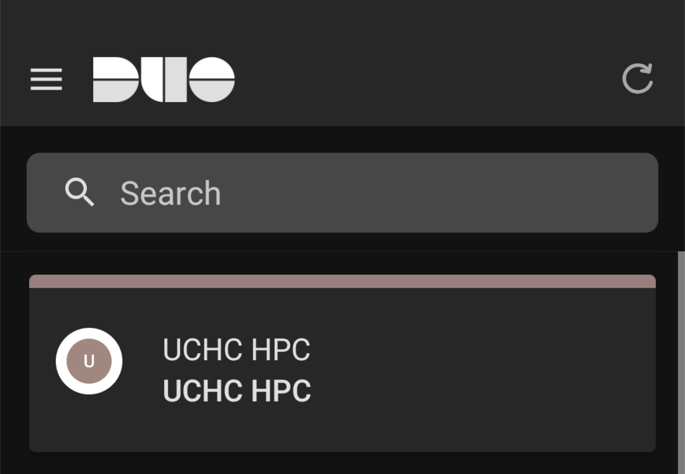

{width=200px}

Access to all UCHC HPC resources requires two-factor authentication through Duo. 

### Enrollment in Duo for UCHC HPC
Once your CAM account has been approved, you will receive an enrollment invitation email from "Duo Security." Follow the link in the email to begin the setup process.

### Duo Mobile App Installation
You will then need to install the Duo Mobile app on a mobile device such as a smartphone or tablet. Hardware tokens and Touch ID are not accepted. The **Duo Mobile** app can be downloaded from the Apple App Store or Google Play Store. Once installed, follow the instructions in the enrollment email to complete the setup process.  

::: {.callout-note}
Note that the UCHC HPC Duo account is distinct from those you might already have with UCHC or Storrs campus. It will appear in the Duo app as "UCHC HPC" as pictured below.

{width="200px"}

:::

### Authentication
When connecting to the HPC system through any method that requires Duo authentication, you will receive a Duo authentication request on your enrolled device. Approve the request to complete the authentication process and access the HPC system. **Do no approve Duo requests that you did not initiate!** If you receive a Duo request that you did not initiate, deny the request and contact us at [cbcsupport@helpspotmail.com](mailto:cbcsupport@helpspotmail.com).