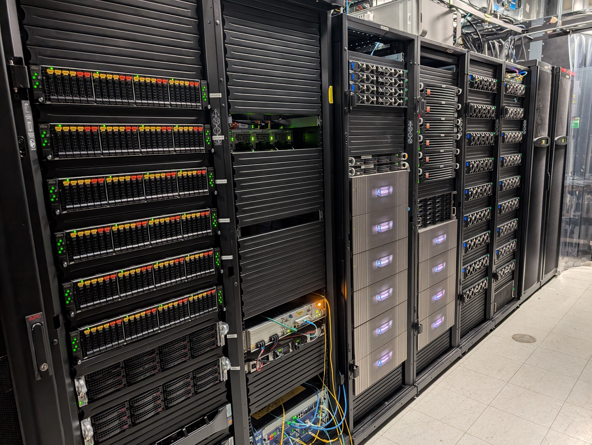
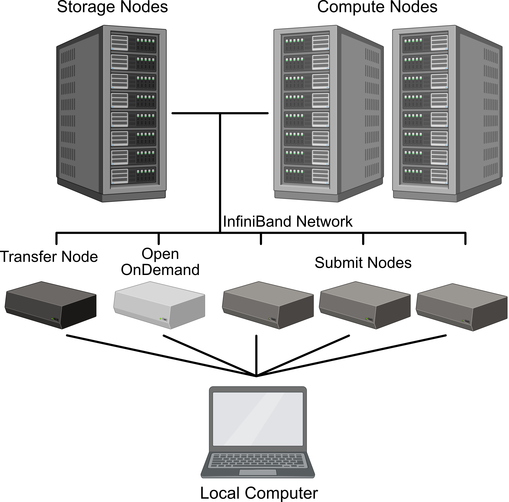
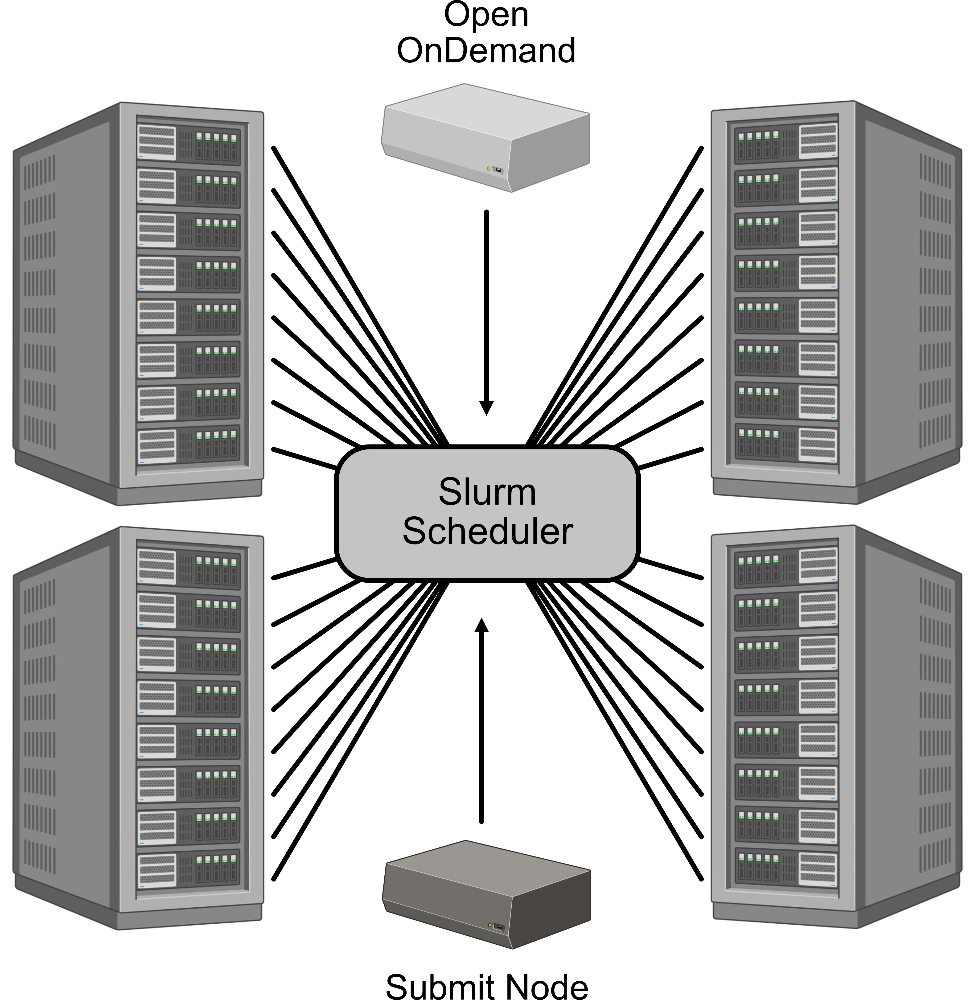

High performance computing (HPC) refers to the use of powerful, interconnected computers to solve large, complex problems that are impractical for a single machine. 
Rather than relying on one system, HPC environments distribute computational tasks across many processors working in parallel.  
This parallelism allows for problems to be broken down into smaller pieces that can be solved simultaneously, significantly reducing the time required to arrive at a solution. 

{width=500px}

## HPC System Architecture
A typical HPC system is organized into specialized components that separate user access, data movement, storage, and computation. 

{width="500px"}

## Login Nodes and Access
Users generally begin by connecting to a login node, which serves as the entry point to the system. Login nodes are designed for lightweight tasks such as editing code, compiling programs, and submitting jobs, rather than running heavy computations. On the UCHC HPC system, a load balancer sits in front of multiple login nodes to distribute incoming connections evenly, ensuring responsiveness and preventing any single node from becoming overloaded.

Login nodes are the gateway to the HPC system, providing users with a command-line interface to interact with the cluster. They are not intended for running computationally intensive tasks, as this can degrade performance for all users. Instead, users should use login nodes to prepare their work, such as editing scripts, compiling code, and submitting jobs to the scheduler. Access to the login nodes is typically secured through

## Data and Storage
Data is stored on dedicated storage nodes that are separate from compute nodes. 
The storage nodes are connected to compute nodes with high-speed interconnects, allowing for fast data transfer between storage and computation. This separation ensures that data-intensive operations do not interfere with the performance of compute nodes, which are optimized for processing rather than storage. 

Movement onto and off of the HPC system is handled through transfer nodes, which are optimized for high-throughput input and output operations. These nodes provide a controlled pathway for moving large datasets in and out of the cluster without interfering with compute performance. Behind the scenes, storage nodes provide access to shared file systems, allowing all parts of the cluster to read and write data efficiently. These storage systems are typically distributed and parallelized, enabling high bandwidth and redundancy for reliability.

## Compute Nodes and Job Scheduling
Computational work takes place on compute nodes, which are the primary engines of the HPC system. These nodes are managed by Slurm, a job scheduling software tool that allocates resources based on user requests and system availability. Users submit jobs specifying the number of CPUs, memory, GPUs, runtime required, and potentially other specifications, and the scheduler places those jobs onto appropriate compute nodes. 

{width="400px"}