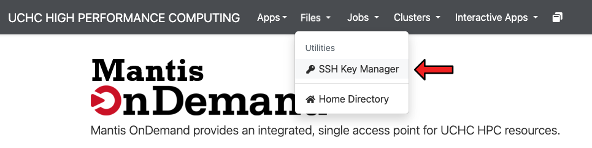
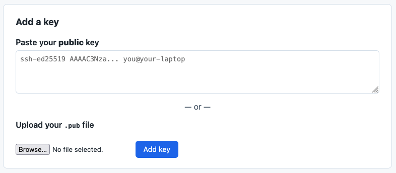

Some modes of access to the HPC system require users to use SSH keys for authentication. 

SSH keys are a secure authentication method that can be used for remote access to a server without using passwords. It is in fact a more secure authentication method than using a password. SSH keys consist of a pair of cryptographic keys --- a private key kept secret on your computer and a public key placed on the remote server you want to access.

While in many cases it is required, the use of SSH keys is also generally recommended for convenience and enhanced security when connecting to any UCHC HPC resources.

To be able to login using SSH keys, you will need to follow the setup process outlined below. Only ed25519 keys are accepted.


### Create SSH keys
You can create a public and private SSH key pair using your SSH client in `Windows PowerShell` or a MacOS / Linux `Terminal`.  

1. First check for an existing SSH key pair by running the following command: 

::: {.panel-tabset}
#### MacOS / Linux Terminal
```bash
ls ~/.ssh/
```

#### Windows PowerShell
```bash
ls $env:USERPROFILE\.ssh\
```
:::

If you see files named `id_ed25519.pub` and `id_ed25519`, you already have an SSH key pair and can skip ahead to the [Copy to UCHC HPC system](#copy-public-ssh-key-to-the-uchc-hpc-system) section. If you do not see these files or get an error message, you will need to create a new SSH key pair.

2. To create a key pair run the following command:

```bash
ssh-keygen -t ed25519 -C <comment>
```

Replacing `<comment>` with something to help you identify which computer this key pair was created for. For example: `laptop`

3. You will be prompted to specify the location to save the key. You can press enter to accept the default location.
4. Next you will be prompted to create a passphrase which is optional. If you don't wish to create a passphrase, simply press enter.

::: {.callout-warning}
Do not share your private key with anyone! Your private key should be kept secret and secure on your computer. If someone else has access to your private key, they can access the UCHC HPC system as you. **We will never ask you for your private key for any reason.**
:::


### Copy Public SSH Key to the UCHC HPC system
Once you have created your SSH key pair, you will need to copy the public key to the UCHC HPC system. This can only be done through the [Open OnDemand](ondemand.qmd) web portal. To copy your public key to the UCHC HPC system, follow the steps below:


#### 1. Copy your public key.

Your public key will be located in the `~/.ssh/` directory located inside of your user home directory. Select your operating system below for instructions on how to copy your public key to your clipboard. 

::: {.panel-tabset}
#### MacOS / Linux Terminal
On MacOS or Linux operating systems, you can easily copy this key to your clipboard by running the following command in the terminal application: 
```bash
pbcopy < ~/.ssh/id_ed25519.pub
```

#### Windows PowerShell
On Windows operating systems, you can easily copy this key to your clipboard by running the following command in the PowerShell application: 
```bash
Get-Content "$env:USERPROFILE\.ssh\id_ed25519.pub" | Set-Clipboard
```
:::


#### 2. Log in to Open OnDemand
See the [Open OnDemand](ondemand.qmd) page for more information about logging in.


#### 3. Click the "Files" dropdown menu and under "Utilities" select "SSH Key Manager".

{width=400px}

#### 4. Paste your key into the "Add a key" text box.

{width=400px}

#### 5. Click the "Add Key" button.
Keys can be removed at any time by clicking the "Remove" button next to the key you wish to remove.