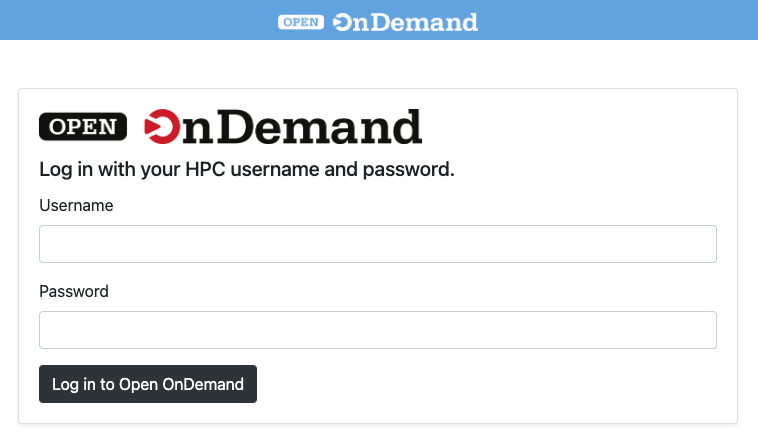
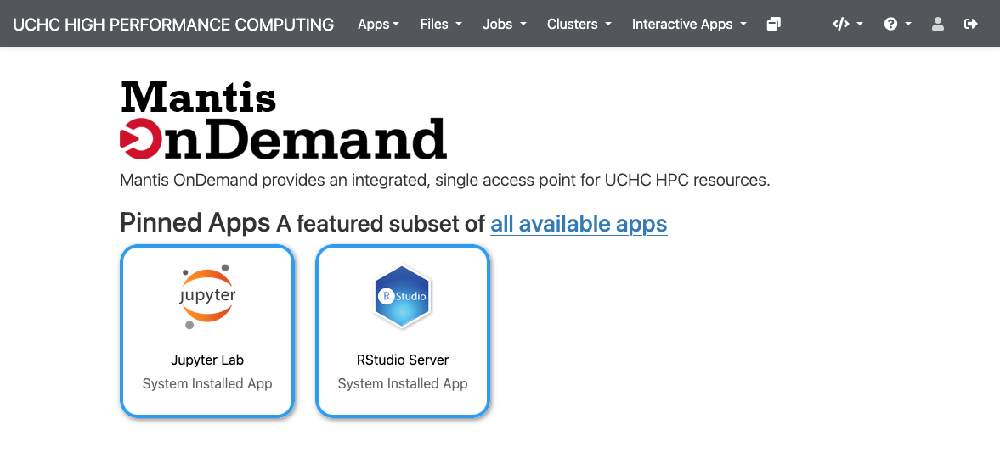
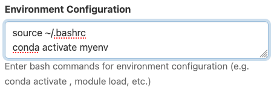
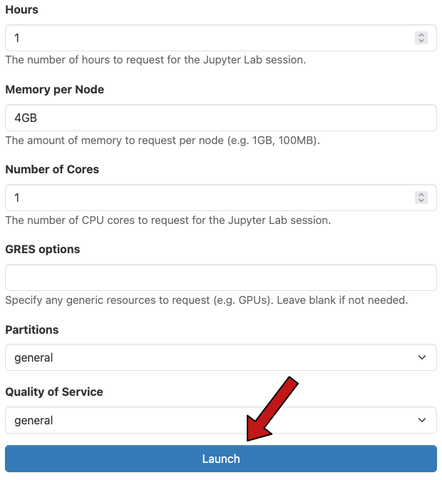
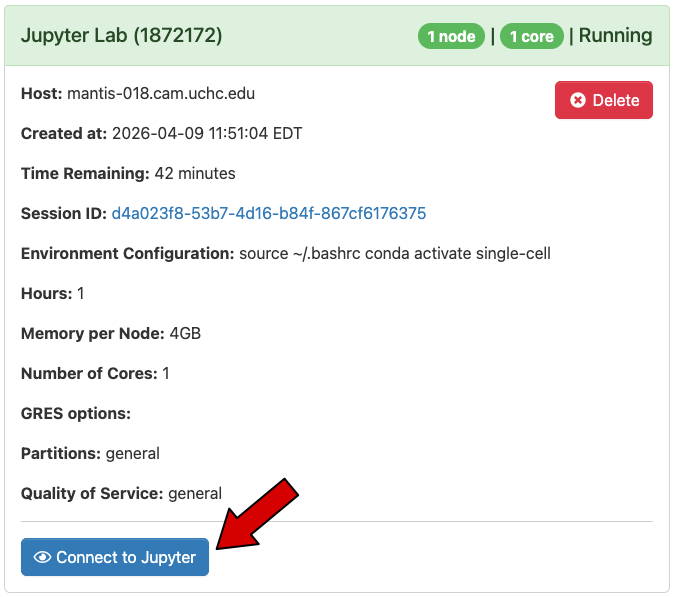
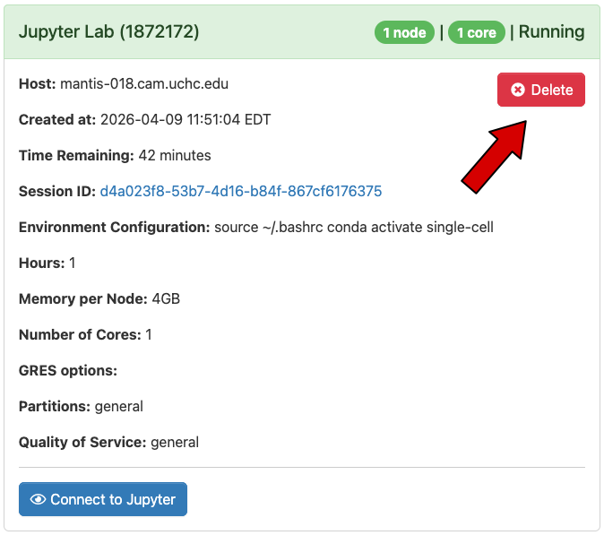

Open OnDemand is a web-based portal that provides users with access to HPC resources. It allows users view and edit files, open a terminal, and use interactive applications through a user-friendly interface. Open OnDemand **only provides access to the Mantis cluster**. If you want to connect to Xanadu or to a virtual machine, you will need to connect through a terminal using SSH. See the [Command Line Interface](cli.qmd) page for instructions on how to connect through a terminal.

## Prerequisites
In order to use Open OnDemand you will need:

- A CAM account with a non-expired password. See the [Getting Started](starting.qmd) page for instructions on how to request an account and reset your password.
- Enrollment in Duo two-factor authentication for UCHC HPC. See the [Duo Two-Factor Authentication](duo.qmd) page for instructions on how to enroll and install the Duo mobile app on your device.
- A web browser. Open OnDemand is compatible with most modern web browsers. 

## Connecting
To connect through Open OnDemand, navigate to [https://ondemand.hpc.cam.uchc.edu](https://ondemand.hpc.cam.uchc.edu) in your web browser. You will be prompted to enter your CAM username and password. When ready, click the "Log in to Open OnDemand" button. You will then recieve a Duo authentication request on your enrolled device. Approve the request to complete the authentication process.

{width=500px} 

Upon successful authentication, you will be taken to the Open OnDemand dashboard. From here, you can access various features and applications available through Open OnDemand.

{width=500px}

## Interactive Apps
Open OnDemand provides access to various interactive applications that run on the Mantis cluster and permit access to the UCHC HPC filesystem.

#### To launch an interactive app:
1. Click the link to the app you want to use.
2. Fill and modify the form specifying the desired resource allocation for you job.
3. The "Environment Configuration" field, available for many of the interactive apps deserves some special attention. This field allows you to make changes to the environment in which your job will run using bash commands. This is useful for loading software modules, activating conda environments, and setting environment variables. In the example below, the ~/.bashrc file is sourced to ensure initialization of conda, and then a conda environment named "myenv" is activated. The app, when launched, will run in the context of the "myenv" conda environment. 

{width=400px}

4. Click the "Launch" button to submit the job to the cluster.

{width=400px}

5. Once the job is running, click the "Connect" button to open the application in a new browser tab.

{width=400px}

6. **Important**. When you are finished using the application, navigate back to "My Interactive Sessions" and click delete to stop the job and free up resources for other users.

{width=400px}

::: callout-warning
Leaving interactive jobs running while you are not actively using them constitutes innapproprate use of the shared cluster resources and prevents other users from accessing those resources. Always remember to stop your interactive jobs when you are finished using them.
:::

## Availabe Applications
- **JupyterLab**: A web-based interactive development environment for Jupyter notebooks, code, and data.
- **RStudio**: An integrated development environment for R programming language.

## Popup & Ad Blockers
Some features of Open OnDemand may not work properly if you have popup blockers or ad blockers enabled in your web browser. If you are experiencing issues with Open OnDemand, try disabling any popup blockers for the [ondemand.cam.uchc.edu](https://ondemand.cam.uchc.edu) url and see if that resolves the issue.