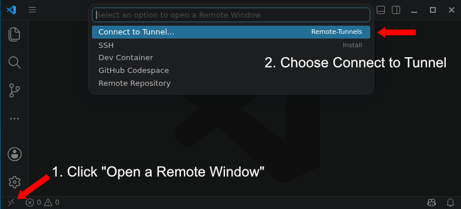
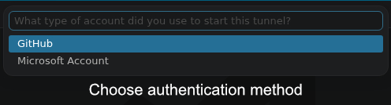
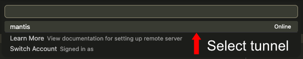

## Environment Modules
Environment modules provide a convenient way of using most of the installed software on the HPC system. Environment modules are a dynamic way to modify your shell environment, allowing you to easily load and unload different software packages, compilers, and libraries without conflicts. They work by setting up the necessary environment variables (like PATH, LD_LIBRARY_PATH, and MANPATH).  

Below is a list of commonly used commands, where `<module>` is the target module. 

| Module Command           | Description |
|--------------------------|-------------|
| `module avail`           | Display all available modules. |
| `module load <module>`   | Loads a specific module into environemnt. |
| `module list`            | Show list of currently loaded modules. |
| `module unload <module>` | Unloads a specific module. |
| `module purge`           | Unloads all loaded modules. |

### Important Caveat
Some of the software available through environment modules was compiled to run on Xanadu and may not be compatible with Mantis.

#### Modules on Mantis
When `module avail` is run on Mantis, you will see three different sections:

Two which contain software compiled to run on Mantis:

- `/isg/shared/spack/share/spack/modules/linux-ubuntu22.04-x86_64_v3`
- `/isg/shared/mantis/modulefiles`

And one that contains software which may or may not run on Mantis as it was compiled to run on Xanadu:

- `/isg/shared/modulefiles`

See [Request Software Installation](#request-software-installation) to request a new installation of incompatible software.

#### Modules on Xanadu
All of the modules available on Xanadu are for software compiled to run on Xanadu.


<!-- # Spack -->
<!-- Going forward, most software on the Mantis cluster will now be installed using [Spack](https://spack.io/), a package manager designed for high-performance computing (HPC) environments. All software installed with Spack can be loaded with environment modules, but users can use spack for managing their sotware environment instead. Spack provides a flexible and powerful way to install, configure, and manage software packages and their dependencies in a reproducible manner. -->

<!-- ### Initialization -->
<!-- To initialize spack, run the following command: -->
<!-- ```bash  -->
<!-- source /isg/shared/spack/share/spack/setup-env.sh -->
<!-- ``` -->

<!-- You could add this to your `.bashrc` or `.bash_profile` to automatically source it in future sessions. -->

<!-- To initialize spack with other shells, find the appropriate setup script in `source /isg/shared/spack/share/spack/`. -->

<!-- ### Loading Software -->
<!-- Already installed software can be loaded using `spack load <software>`. To see a list of available software, run `spack find`. -->


<!-- ### Installing Software -->
<!-- If you want to install packages with Spack, you must first chain your home directory configuration to the cluster's Spack installation. To do so run: -->
<!-- ```bash -->
<!-- spack config add upstreams:spack-instance-1:install_tree:/isg/shared/spack/opt/spack -->
<!-- ``` -->

## Compiling software yourself

Some software is pretty easy to install. See this classic softare in population genetics, [psmc](https://github.com/lh3/psmc). 

All you have to do to install are the following commands (the instructions are in the README.md file):

```bash
# clone the repository
git clone https://github.com/lh3/psmc.git
cd psmc
make; (cd utils; make)
```

And it should create an executable binary. Some software is slightly more complicated, but still manageable by novice to intermediate users. 

Some software, however can be very difficult, with a complex chain of dependencies, in which case we often rely on containerization with [Singularity](#singularity) or use isolated environments created with [Conda](#conda)

## Singularity
<!-- TODO: Replace this section with Apptainer -->
Reproducing environments and managing dependencies is difficult problem. Containerization is a powerful solution, allowing users to package software and its dependencies into a single, portable unit. Singularity is a container platform that is well-suited for HPC environments and can additionally use Docker images (Docker is the other major containerization platform and unavailable on Mantis). 

Singularity is in your `PATH` by default on Mantis so it can be run without loading a module.  

To get an existing container from a repository, you use the command `singularity pull <URL>`. For example:

```bash
singularity pull https://depot.galaxyproject.org/singularity/fastqc:0.12.1--hdfd78af_0
```
This will create the file `fastqc:0.12.1--hdfd78af_0`, a singularity image (some image files will have the extension `.sif`). This containst the package `fastqc`. 

To run a command (e.g. `fastqc --help`) inside the container, particularly when submitting SLURM batch scripts, you typically you will use `singularity exec <container> <command>`:

```bash 
singularity exec fastqc:0.12.1--hdfd78af_0 fastqc --help
```

You can also start up a shell inside the container and explore interactively with `singularity shell <container>`. 

```bash
singularity shell fastqc:0.12.1--hdfd78af_0
```

See [here](https://singularity-tutorial.github.io/) for a more in-depth tutorial. 


## Conda
Conda is a package and environment manager that allows users to install and run software in isolated environments. It is particularly useful for software with complicated dependencies that may span multiple languages.

When users install software with conda the software and dependencies are downloaded from one or more repositories, known as *channels*. 

::: {.callout-warning}
Some `conda` commands utilize a lot of CPU which can negatively impact other users if run on login nodes. Please refrain from running conda command such as `conda install`, `conda update`, or `conda create` on login nodes. Instead, use an [interactive session](running.qmd#interactive-job) or a [batch job](running.qmd#batch-job-submission) to run these commands. Any long-running, resource-intensive processes running on login nodes may be terminated without notice.  
:::

### Installing Conda
Conda is distributed in many ways (e.g. anaconda, miniconda), but we ask our users to install the [`Miniforge`](https://github.com/conda-forge/miniforge) distribution.

Miniforge is a lightweight, minimalist installation of Conda. Importantly, Miniforge only uses the `conda-forge` channel by default. `conda-forge` is free and community-maintained. Other distributions are configured to use the `defaults` channel. While `defaults` is not protected by a paywall, it is operated by Anaconda Inc, a for-profit entity and is not free to use. 

#### Start interactive session

To get the Miniforge conda distribution first start an interactive session. 

```bash
srun --qos=general --mem=8gb --pty bash
```

#### Download miniforge installer
```bash
wget -O Miniforge3.sh "https://github.com/conda-forge/miniforge/releases/latest/download/Miniforge3-$(uname)-$(uname -m).sh"
```
There is no need to substitute anything in the URL. The command as given will download the installation script.

#### Run the Miniforge Installation Script
```bash
bash Miniforge3.sh
```

1. Agree to license terms (yes)
2. Choose installation path (default is fine)
3. **Important**: Choose whether to initialize conda (select "yes")


#### Activate Conda
This will happen automatically when you start a new interactive shell session, but to load it into your current session, run:

```bash
source ~/.bashrc
```

:::{.callout-note}
~/.bashrc is only sourced within interactive sessions such as when you are logged in to a login node or have an interactive job running. If you want to use Conda in non-interactive sessions (e.g. batch jobs), you will need to take an extra step. One option is to simply add `source ~/.bashrc` to your batch job scripts which will recreate your typical environment on a compute node. Another option is to explicitly source the conda setup script in your batch job scripts with: `source ~/miniforge3/etc/profile.d/conda.sh` (assuming you installed Miniforge to the default location of `~/miniforge3`) or `source <miniforge path>/etc/profile.d/conda.sh`, substituting `<miniforge path>` with the appropriate path if you did not install to the default location. This can be desirable if you want more control over what is loaded in your batch job environment.
:::


#### Base Envirionment 
By default, conda creates a "base" environment when it is installed. This environment contains the core conda packages and tools. It is generally recommended to avoid installing additional packages into the base environment to keep it clean and stable. You can prevent the base environment from being activated automatically when you start a new shell session by running the following command:
```bash
conda config --set auto_activate false
``` 
This only needs to be run one time. After running this command, the base environment will not be activated automatically in new shell sessions.


### Using Conda
It is recommended to create separate environments for different projects or sets of packages to avoid conflicts and to avoid installing packages into the base environment. Below are the basic commands for creating environments, activating them, and installing packages. 

#### Creating an Environment
Once Miniforge is installed, you can create environments with:

```bash
conda create -n <environment name> 
```
Replace `<environment name>` with the desired name for your environment.

Confirm changes when prompted.

#### Activating & Deactivating an Environment
Once you have created an environment, you can activate it with:

```bash
conda activate <environment name>
```
Replace `<environment name>` with the name of the environment you want to activate.

Once activated you can install or use packages within that environment.

To see a list of all your environments, run:
```bash
conda env list
```

To deactivate the current environment and return to the base environment, run:
```bash
conda deactivate
```

#### Installing Packages
In order to install packages into a Conda environment, you first need to activate the environment (see above).
Once activated, packages can be installed with: 

```bash
conda install <package name>
```

Some packages may require specifying a channel with the `-c <channel name>` argument. For example, to install a package from the `bioconda` channel, you would run:
```bash
conda install -c bioconda <package name>
```


To see a list of installed packages in the current environment, run:
```bash
conda list
```
:::{.callout-warning}
Please avoid using the `defaults` channel, or any channel that is not free. `conda-forge` and `bioconda` are free, community maintained channels that should fit the needs of most users. 
:::

#### Mamba
The `mamba` command, a faster drop in replacement for `conda`, will also by installed with Miniforge. We encourage the use of `mamba` in place of any `conda` commands. No changes to the syntax are necessary, simply replace `conda` with `mamba`.

## Request Software Installation
Users can request the installation of software by [submitting a software request](https://bioinformatics.uconn.edu/contact-us/software-database-request/). We can create global environment modules, help you compile something in your home directory, or if you need, help you get a singularity container running or set up conda. 


## VSCode
[Visual Studio Code](https://code.visualstudio.com/) is a free and open-source code/text editor. You can use it to edit files on the UCHC HPC system remotely. It has many useful features, including syntax highlighting, code completion, and debugging tools.

### Usage
#### 1. Start an interactive session
Launch an interactive session with the command:
```bash
srun --qos=general --mem=8gb --pty bash
```

#### 2. Launch VSCode and Authenticate
Once the interactive session has started, you can start VSCode and authenticate with a GitHub or Microsoft account. 

::: {.panel-tabset}
##### GitHub
In order to authenticate with a GitHub account, run the following commands:

```bash
module load vscode
code tunnel --name mantis 
```

Look for the URL and authentication code in the output of the command. It will look like:

> To grant access to the server, please log into https://github.com/login/device and use code \<authentication code\> to authenticate.

##### Microsoft
In order to authenticate with a Microsoft account, run the following commands:
```bash
module load vscode
code tunnel user login --provider microsoft
code tunnel --name mantis 
```

Look for the URL and authentication code in the output of the command. It will look like:

> To sign in, use a web browser to open the page https://login.microsoft.com/device and enter the code \<authentication code\> to authenticate.

:::

Navigate to the URL in your web browser and enter the code provided. You will be prompted to log in with your GitHub or Microsoft account account. 

#### 3. Connect
Open VSCode on your local computer and click the `Open a Remote Window` icon and select `Connect to Tunnel` as shown below. 

{width=600}

Then select the authentication method and follow the prompts to authenticate.

{width=400}

Finally, select the `mantis` tunnel to connect.

{width=500}


## Commercial Software

The Computational Biology Core posesses licenses for some commercial software and is available to use by any UConn or UConn Health researcher.

### IPA

Ingenuity Pathway Analysis from Qiagen "allows you to “quickly visualize and understand complex ‘omics data and perform insightful data analysis and interpretation by placing your experimental results within the context of biological systems”.

Request an account [here](https://bioinformatics.uconn.edu/ipa_registration/). 

Log in [here](https://apps.ingenuity.com/ingsso/login?service=https%3A%2F%2Fanalysis.ingenuity.com%2Fpa%2Flogin%2Fcas)

[Some training materials](https://digitalinsights.qiagen.com/ipa-training/)

### Geneious

[Geneious](https://www.geneious.com/) is a software package which allows you to run many common bioinformatic workflows in a graphical user interface. It runs on your local machine.

The CBC used to provide access to a floating license but Geneious has changed their licensing model to eliminate floating licenses. The CBC has acquired a handful of licenses, valid until July 2027 to prevent disruption of researchers who have been using Geneious. If you are a UConn or UConn Health researcher and need access to Geneious, please contact the CBC at [cbcsupport@helpspotmail.com](mailto:cbcsupport@helpspotmail.com). After July 2027, users will need to acquire their own license to continue using Geneious. 


## Virtual Machines

If you need to run something that requires a virtual machine, you can request one [here](https://health.uconn.edu/high-performance-computing/contact/). 
