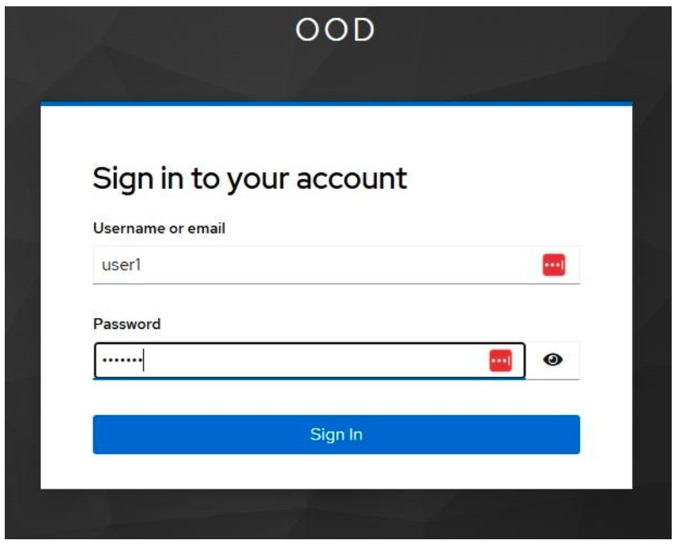
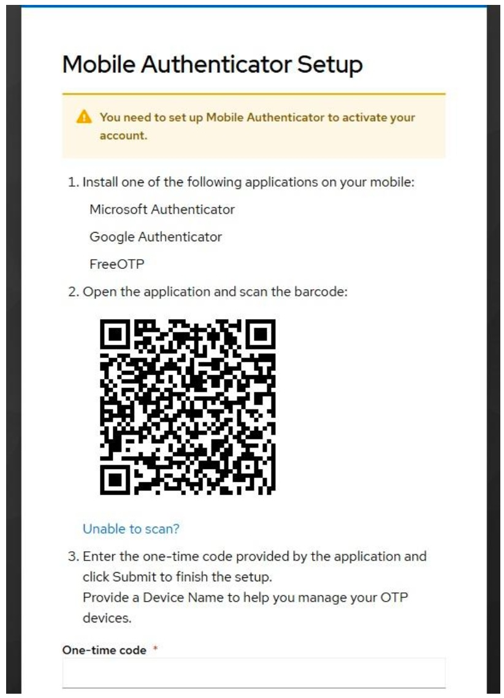

The Mantis computer cluster is available for instructors at UConn and UConn Health who wish to use it in their courses. This document provides basic information for instructors (and students) who use it in their courses. 

::: {.callout-important}
### Important
Due to changes in security policies, Xanadu can no longer be used for teaching. All courses starting Fall 2026 must use Mantis. 
:::

## Course accounts

Accounts for a given course can be [created on request here](https://health.uconn.edu/high-performance-computing/contact/). Select the `Submit a Ticket` tab and under `Request Type` select **Course or Workshop Accounts**. 

A course directory will be created under `/home/FCAM`, and user accounts will be populated there. For example, the course MCB5672 has directory `/home/FCAM/mcb5672/`. Within that are numbered user home directories:

```
$ ls -lh /home/FCAM/mcb5672/
total 28K
drwxrwx--T 11 jklassen domain users 6.5K Jan 20  2026 usr1
drwxrwx--T 13 jklassen domain users  23K Jan 21  2026 usr2
drwxrwx--T 15 jklassen domain users  12K Jan 19  2026 usr3
drwxrwx--T 18 jklassen domain users  12K Jan 20  2026 usr4
drwxrwx--T 15 jklassen domain users 9.5K Jan 22  2026 usr5
drwxrwx--T 11 jklassen domain users 5.5K Feb  8 13:15 usr6
drwxrwx--T  7 jklassen domain users 6.0K Jan 15  2026 usr7
```

These directories are owned by the instructor, in this case `jklassen`. 

Course user IDs will be `mcb5672usr1`, `mcb5672usr2` etc. The course instructor will be provided with a table listing user IDs and passwords (which can be changed) for each account. 

### Instructor access to course accounts

Because the course account home directories are owned by the instructor, they are accessible by default. If the instructor retains course account passwords, the instructor may also switch to a student account after logging in to the server using the command:

```bash
su - mcbstudent5672usr1
```

and entering that user's password. 

## Connecting to Mantis

With updated security requirements, course account access to Mantis is only through a special instance of Open OnDemand and requires 2-factor authentication with an authenticator app. Several apps are suitable, including Google Authenticator, Microsoft Authenticator and FreeOTP. Once configured these apps generate [time-based one-time passwords](https://en.wikipedia.org/wiki/Time-based_one-time_password)(TOTP) as a second form of authentication in addition to your user ID and password. 

To log in with a course account, visit [https://learn.hpc.cam.uchc.edu](https://learn.hpc.cam.uchc.edu) and enter the user ID and password assigned to you:

{width=30%}

Upon initial login you will be presented with the Mobile Authenticator Setup message with instructions to configure your OTP device. 

Follow the instructions, retrieve the code from the OTP application you have chosen. Enter the code in the One-time code field and click “Submit”. You will be logged into the Mantis Open OnDemand portal. 


{width=30%}


## Open OnDemand

[Open OnDemand](https://www.openondemand.org/) allows remote access to Mantis resources via a web browser. Some key resources are available in the form of "apps". 

- You can start a BASH terminal. Once there you can request resources for an interactive session as usual. 
- You can open a GUI desktop with the "Mantis Desktop" app. 
- You can start RStudio or Jupyter sessions. 

Please contact us with questions or requests for specific apps. 

## Resource requests

On Mantis, a "partition" defines a group of nodes, and a "quality of service" (QoS) sets the conditions of access. 

In the past we had a teaching partition, but because those resources frequently sat idle, we are trying a new approach. Courses should now use the `general` partition for most, if not all, work. `himem` resources are scarce and course accounts should not request them unless they are specifically required. 

Student accounts will have access to four QoSes: `student`, `interactive`, `general`, and `debug`. 

  - `student` QoS has a per user limit of 24 CPUs and 64G of memory. It has *very high priority*, so resource requests with this QoS should be granted very quickly. This should allow courses that require compute resources during class to obtain them without a wait. There is no limit on the total resources available to the QoS, so if classes overlap in time they will not compete for resources as they would on a small partition. 
  - `interactive` QoS has similarly high priority but [slightly lower resource limits](running.qmd#interactive-job) and is intended for interactive sessions. It is limited to one concurrent job per user. 
  - `general` QoS is the general purpose QoS used by most cluster users. Jobs submitted with this QoS have much larger resource limits and are subject to standard queueing policies. 
  - `debug` QoS has very high priority but jobs are restricted to 5 minute wall times and 2 concurrent jobs. This QoS is intended for test running scripts to check for problems. 

### Example resource requests:

For an interactive session with 2 cpus and 8G of memory:

```bash
srun -p general --qos=interactive -c 2 --mem=8G --pty bash
```

`student` QoS would be suitable for this as well. 

For a batch script intended to start very quickly (e.g. during class):

```bash
#!/bin/bash
#SBATCH --job-name=map_reads
#SBATCH -n 1
#SBATCH -c 12
#SBATCH --mem=20G
#SBATCH --partition=general
#SBATCH --qos=student
#SBATCH -o %x_%j.out
#SBATCH -e %x_%j.err
```

Students with compute needs that exceed `student` QoS (e.g for a final project) can use `general` QoS. 

## Data transfer

If users wish to upload or download files from their home directories select the `Files` menu and then `Home Directory`. Files can be transferred here. 

For large files, students can use [Globus](transfer.qmd#globus). It is not recommended for anyone with a regular CAM HPC account to try to link a student account. 