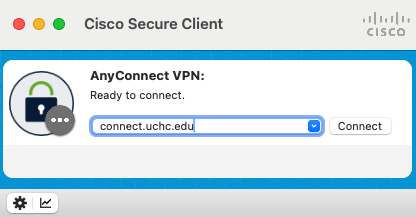

Some modes of access to the HPC system require users to be connected to a VPN using the Cisco Secure Client. Below are instructions for 

## HPC users not using UConn Health IT managed (UCH domain member) devices

### Reqesting VPN access
1) Users must submit a request for access by submitting a [Request Ticket](https://health.uconn.edu/high-performance-computing/contact/)
2) YOu will receive an email regarding DUO enrollment from "DUO Security". Follow the instructions to enroll in DUO.

### Installation
Once granted access, set the [Cisco Secure Client installation intstructions]() to install the application.

### Connecting
1) Open the Cisco Secure Client application on your computer.
2) In the address field, enter `connect.uchc.edu/cam`. Click on the “Connect” button.
3) When prompted, enter your CAM username and password to login.

{width="400px"}

## HPC users who use UConn Health IT managed (UCH domain member) devices
### Installation
To install the Cisco Secure Client, follow the [UCHC IT instructions](https://uchc.sharepoint.com/sites/myUCONNHealth/updates/Lists/Posts/Post.aspx?ID=466&CT=1771426801029&OR=OWA-NT-Mail&CID=4f4de9bc-66a0-e44e-d76f-eb7cf9875b1f).

### Connecting
1) Open the Cisco Secure Client application on your computer.
2) In the address field, enter `connect.uchc.edu`. Click on the “Connect” button.
3) When prompted, enter your XXXXXXXX username and password to login.

{width="400px"}

